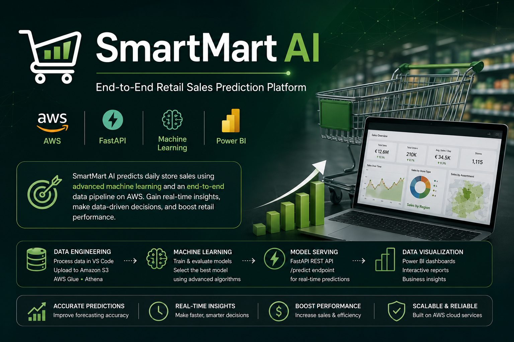
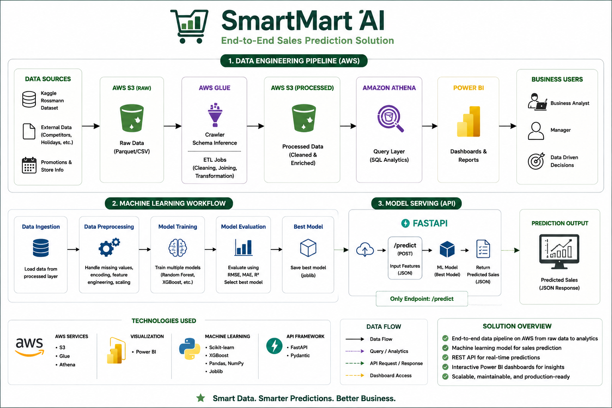
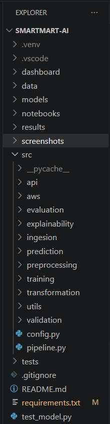

  

<h1 align="center">🛒 SmartMart AI</h1>

An End-to-End Retail Sales Prediction Platform combining <b>Data Engineering</b>, <b>Machine Learning</b>, <b>FastAPI</b>, <b>AWS</b>, and <b>Power BI</b>.

---

## Project Overview

SmartMart AI is an end-to-end retail sales prediction platform built using modern Data Engineering and Machine Learning practices. The project processes retail sales data locally using Python, uploads the processed dataset to Amazon S3, catalogs it with AWS Glue, queries it through Amazon Athena, and visualizes business insights in Power BI.

The machine learning pipeline trains multiple regression models, automatically selects the best-performing model based on evaluation metrics, and deploys it using a FastAPI REST API for real-time sales prediction.

This project demonstrates practical skills in data engineering, cloud analytics, machine learning, REST API development, and business intelligence in a single portfolio project.

## ✨ Features

- 📊 End-to-end retail sales prediction platform
- 🛠 Automated ETL pipeline for data ingestion, validation, cleaning, and transformation
- ☁️ Cloud-based analytics using Amazon S3, AWS Glue, and Amazon Athena
- 📈 Interactive business dashboards built with Power BI
- 🤖 Multiple machine learning models (Linear Regression, Random Forest, XGBoost)
- 🏆 Automatic best model selection based on evaluation metrics
- 🔍 Feature importance analysis for model interpretability
- 🚀 REST API built with FastAPI for real-time sales prediction
- 📦 Modular project structure following software engineering best practices

## 🏗️ Project Architecture

The following diagram illustrates the complete workflow of the SmartMart AI platform, from local data processing and cloud analytics to machine learning and API-based prediction.

    

## 🛠️ Technology Stack

| Category | Technologies |
|-----------|--------------|
| Programming | Python |
| Data Processing | Pandas, NumPy |
| Machine Learning | Scikit-learn, XGBoost |
| Data Engineering | AWS S3, AWS Glue, Amazon Athena |
| API | FastAPI|
| Data Visualization | Power BI |
| Model Serialization | Joblib |
| Development | VS Code, Git, GitHub |

## 📂 Project Structure

    

The project follows a modular architecture that separates data engineering, machine learning, API development, and evaluation into independent components, making the codebase easier to maintain and extend.

## ⚙️ Data Engineering Pipeline

The ETL pipeline prepares the raw retail dataset for analytics and machine learning through several stages:

- Data ingestion
- Data validation
- Data cleaning
- Feature engineering
- Data transformation
- Export processed dataset

After preprocessing in Python, the processed dataset is uploaded to **Amazon S3**, cataloged using **AWS Glue**, queried through **Amazon Athena**, and connected to **Power BI** for dashboard development.

    

