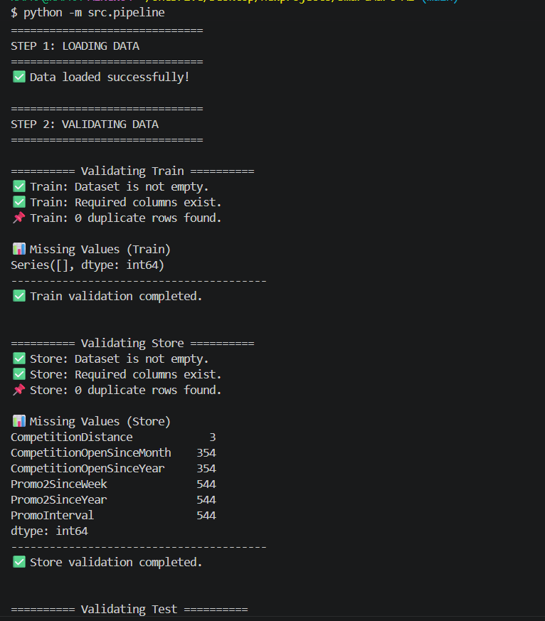
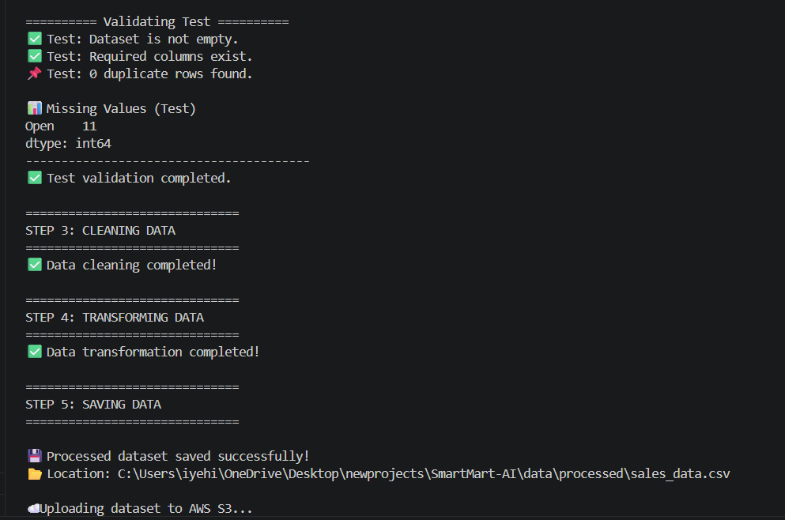
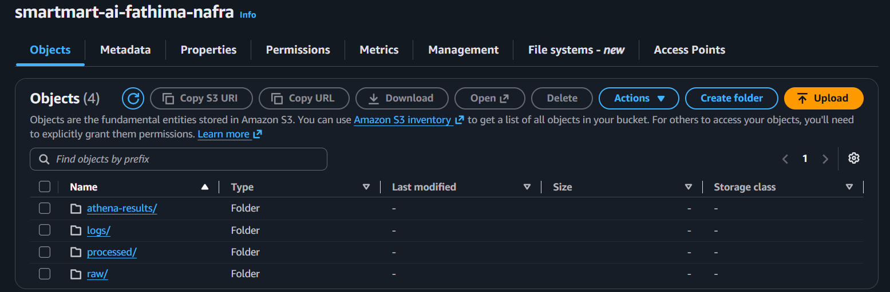
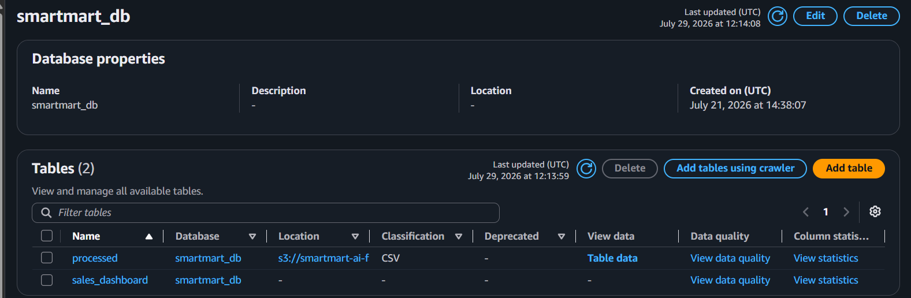
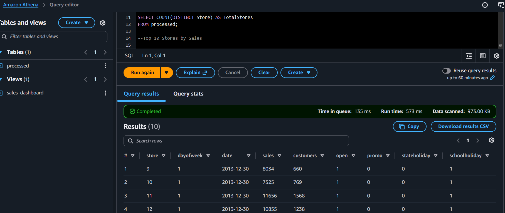
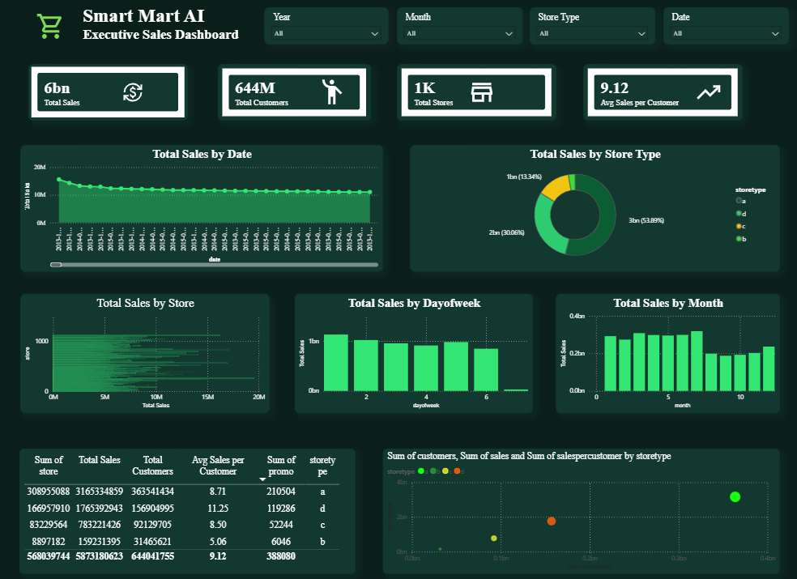
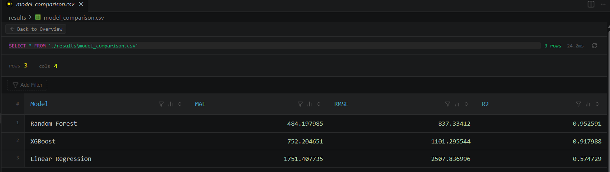
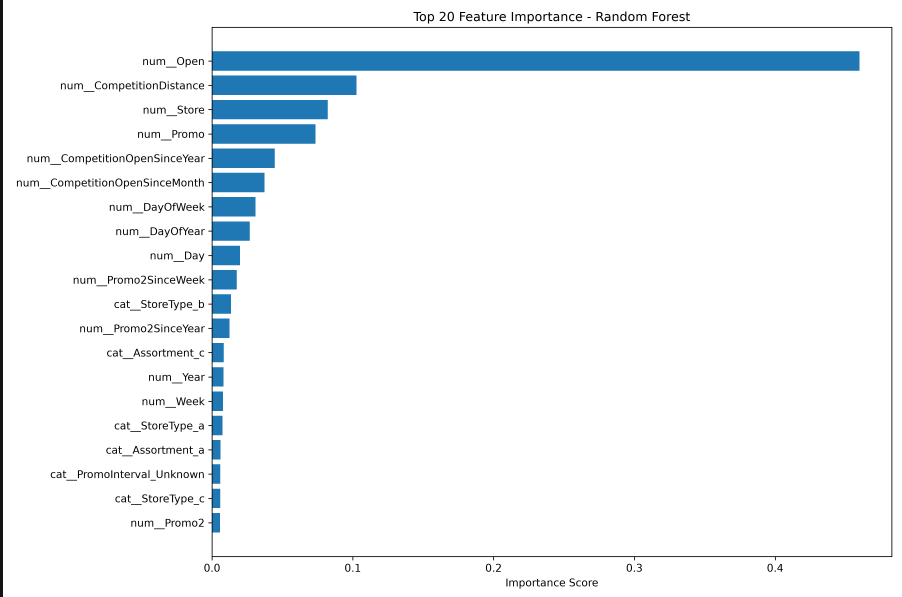
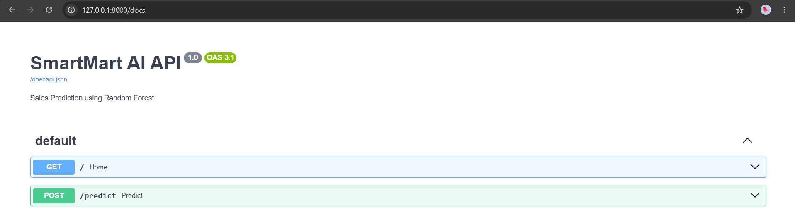
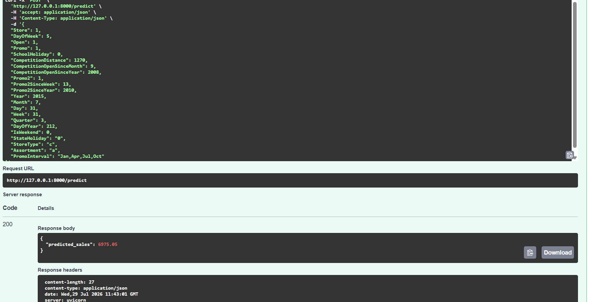

<p align="center">
  
</p>

<h1 align="center">🛒 SmartMart AI</h1>

<p align="center">
An End-to-End Retail Sales Prediction Platform combining <b>Data Engineering</b>, <b>Machine Learning</b>, <b>FastAPI</b>, <b>AWS</b>, and <b>Power BI</b>.
</p>

<p align="center">


</p>

---

## Project Overview

SmartMart AI is an end-to-end retail sales prediction platform built using modern Data Engineering and Machine Learning practices. The project processes retail sales data locally using Python, uploads the processed dataset to Amazon S3, catalogs it with AWS Glue, queries it through Amazon Athena, and visualizes business insights in Power BI.

The machine learning pipeline trains multiple regression models, automatically selects the best-performing model based on evaluation metrics, and deploys it using a FastAPI REST API for real-time sales prediction.

This project demonstrates practical skills in data engineering, cloud analytics, machine learning, REST API development, and business intelligence in a single portfolio project.

## ✨ Features

- 📊 End-to-end retail sales prediction platform
- 🛠 Automated ETL pipeline for data ingestion, validation, cleaning, and transformation
- ☁️ Cloud-based analytics using Amazon S3, AWS Glue, and Amazon Athena
- 📈 Interactive business dashboards built with Power BI
- 🤖 Multiple machine learning models (Linear Regression, Random Forest, XGBoost)
- 🏆 Automatic best model selection based on evaluation metrics
- 🔍 Feature importance analysis for model interpretability
- 🚀 REST API built with FastAPI for real-time sales prediction
- 📦 Modular project structure following software engineering best practices

## 🏗️ Project Architecture

The following diagram illustrates the complete workflow of the SmartMart AI platform, from local data processing and cloud analytics to machine learning and API-based prediction.

<p align="center">
    
</p>

## 🛠️ Technology Stack

| Category | Technologies |
|-----------|--------------|
| Programming | Python |
| Data Processing | Pandas, NumPy |
| Machine Learning | Scikit-learn, XGBoost |
| Data Engineering | AWS S3, AWS Glue, Amazon Athena |
| API | FastAPI|
| Data Visualization | Power BI |
| Model Serialization | Joblib |
| Development | VS Code, Git, GitHub |

## 📂 Project Structure

<p align="center">
    
</p>

The project follows a modular architecture that separates data engineering, machine learning, API development, and evaluation into independent components, making the codebase easier to maintain and extend.

## ⚙️ Data Engineering Pipeline

The ETL pipeline prepares the raw retail dataset for analytics and machine learning through several stages:

- Data ingestion
- Data validation
- Data cleaning
- Feature engineering
- Data transformation
- Export processed dataset

After preprocessing in Python, the processed dataset is uploaded to **Amazon S3**, cataloged using **AWS Glue**, queried through **Amazon Athena**, and connected to **Power BI** for dashboard development.

<p align="center">
    <br>
    
</p>

## ☁️ Cloud Data Pipeline (AWS)

After preprocessing the retail dataset locally using Python, the processed `sales.csv` file is uploaded to Amazon S3 for cloud storage. AWS Glue is then used to catalog the dataset, making it available for querying through Amazon Athena. Finally, Power BI connects to Athena to build interactive dashboards for business analysis.

### Amazon S3

The processed dataset is stored securely in an Amazon S3 bucket.

<p align="center">
    
</p>

### AWS Glue

AWS Glue catalogs the processed dataset, creating metadata that enables SQL-based analytics.

<p align="center">
    
</p>

### Amazon Athena

Amazon Athena is used to query the processed retail dataset directly from Amazon S3 using SQL.

<p align="center">
    
</p>

## 📊 Business Intelligence Dashboard

Power BI connects to Amazon Athena to visualize retail sales insights through an interactive dashboard. The dashboard provides key performance indicators, sales trends, and business analytics to support decision-making.

<p align="center">
    
</p>

### Dashboard Highlights

- 📈 Sales trend analysis
- 🏪 Store performance insights
- 📅 Time-based sales analysis
- 📊 Interactive filtering and drill-down capabilities

## 🤖 Machine Learning Workflow

The processed dataset is used to train multiple regression models for retail sales prediction. Each model is evaluated using standard regression metrics, and the best-performing model is automatically selected for deployment.

### Model Comparison

<p align="center">
    
</p>

### Feature Importance

<p align="center">
    
</p>

### Models Evaluated

- Linear Regression
- Random Forest Regressor
- XGBoost Regressor

The best-performing model is serialized using **Joblib** and deployed through the FastAPI application.

## 🌐 FastAPI Prediction API

The trained machine learning model is exposed through a FastAPI REST API, allowing users to submit retail store information and receive real-time sales predictions.

### API Documentation

<p align="center">
    
</p>

### Prediction Example

<p align="center">
    
</p>

### API Features

- RESTful API built with FastAPI
- Automatic interactive Swagger documentation
- JSON request and response format
- Real-time sales prediction

# 🚀 Installation & Setup

Follow these steps to set up the project on your local machine.

## 1️⃣ Clone the Repository

```bash
git clone https://github.com/<your-username>/SmartMart-AI.git
cd SmartMart-AI
```

## 2️⃣ Create a Virtual Environment

### Windows

```bash
python -m venv .venv
.venv\Scripts\activate
```

### macOS / Linux

```bash
python3 -m venv .venv
source .venv/bin/activate
```

## 3️⃣ Install Dependencies

```bash
pip install -r requirements.txt
```

## 4️⃣ Configure AWS Credentials

Configure your AWS credentials before using Amazon S3, AWS Glue, or Amazon Athena.

```bash
aws configure
```

Provide:

- AWS Access Key ID
- AWS Secret Access Key
- Region (e.g., `ap-south-1`)
- Output format (`json`)

---

# ▶️ Running the Project

## Run the ETL Pipeline

```bash
python -m src.pipeline
```

This performs:

- Data ingestion
- Data validation
- Data cleaning
- Feature engineering
- Data transformation
- Processed dataset generation

---

## Start the FastAPI Server

```bash
uvicorn src.api.api:app --reload
```

Open the API documentation:

```
http://127.0.0.1:8000/docs
```

---

## View the Power BI Dashboard

1. Upload the processed dataset to Amazon S3.
2. Create or refresh the AWS Glue catalog.
3. Query the dataset using Amazon Athena.
4. Connect Power BI to Athena using the Athena ODBC connector.
5. Refresh the report to visualize the latest sales insights.

---

# 🔮 Future Improvements

The project can be enhanced with several additional features:

- 📦 Containerize the application using Docker
- ☁️ Deploy the FastAPI application on AWS
- 🔄 Automate the ETL pipeline with Apache Airflow
- 📈 Implement real-time sales prediction
- 🤖 Explore advanced deep learning models for forecasting
- 🔔 Add automated monitoring and alerting
- 📊 Develop interactive web dashboards using Streamlit

---

# 👩‍💻 Author

## Fathima Nafra

**BSc (Hons) Computer Science (Data Science)**  
University of Kelaniya, Sri Lanka


---

⭐ If you found this project useful, consider giving it a star on GitHub!